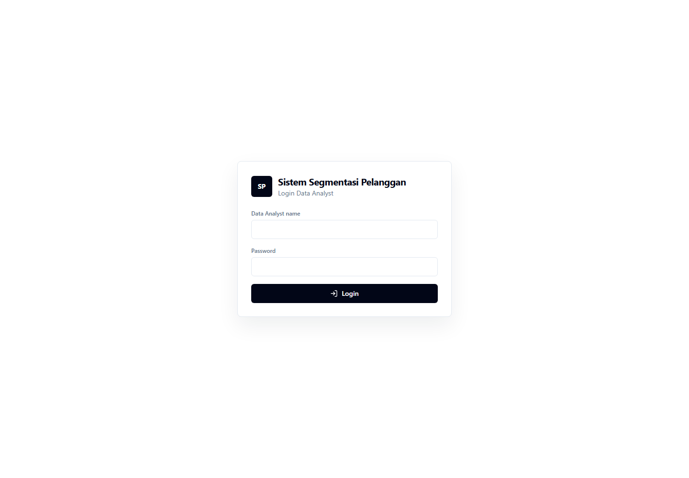
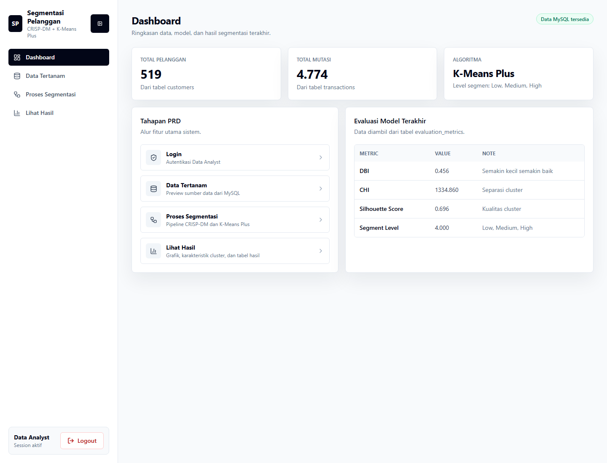
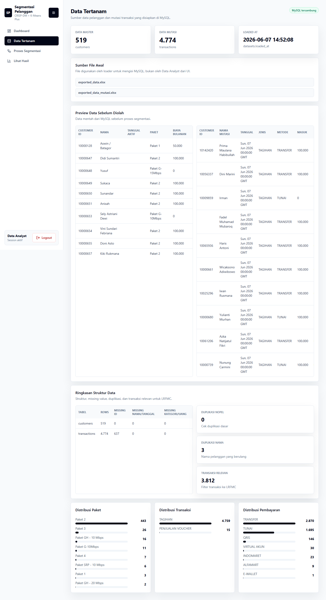
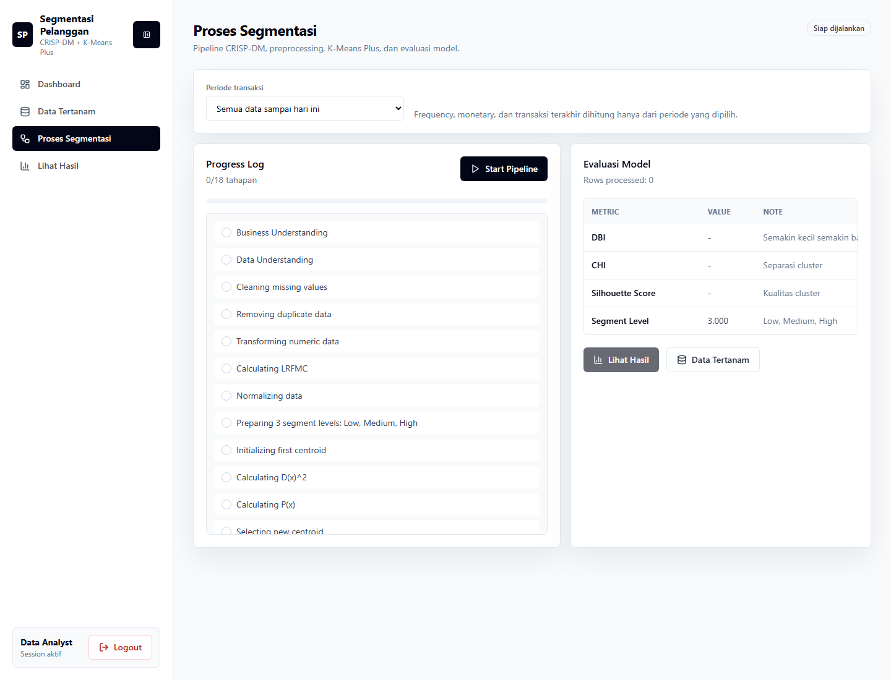
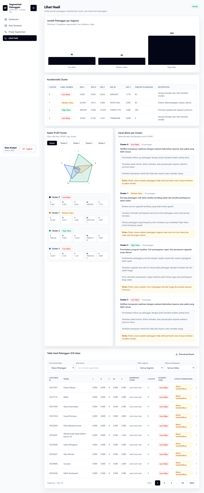

# Sistem Segmentasi Pelanggan

Aplikasi web untuk segmentasi pelanggan berbasis **CRISP-DM**, fitur **LRFMC**, dan algoritma **K-Means Plus**. Sistem ini membantu Data Analyst melihat data tertanam dari MySQL, menjalankan proses segmentasi, mengevaluasi model, lalu membaca hasil segmentasi pelanggan beserta rekomendasi bisnis.

## Ringkasan Section

| No | Section | Fungsi Utama |
| --- | --- | --- |
| 1 | Login | Autentikasi Data Analyst sebelum masuk ke dashboard. |
| 2 | Dashboard | Ringkasan jumlah data, status MySQL, alur PRD, dan evaluasi model terakhir. |
| 3 | Data Tertanam | Preview sumber data pelanggan dan transaksi dari MySQL sebelum diproses. |
| 4 | Proses Segmentasi | Menjalankan pipeline CRISP-DM, preprocessing, K-Means Plus, dan evaluasi model. |
| 5 | Lihat Hasil | Menampilkan grafik segmentasi, karakteristik cluster, rekomendasi bisnis, tabel pelanggan, dan export hasil. |

## 1. Login



Section **Login** adalah gerbang awal aplikasi untuk Data Analyst. Pengguna memasukkan nama analyst dan password, lalu sistem melakukan autentikasi melalui API backend. Jika login berhasil, sesi disimpan di browser dan pengguna diarahkan ke halaman utama aplikasi.

## 2. Dashboard



Section **Dashboard** menampilkan gambaran cepat kondisi sistem. Bagian ini berisi total pelanggan, total mutasi transaksi, algoritma yang digunakan, status ketersediaan data MySQL, alur fitur utama, dan tabel evaluasi model terakhir seperti DBI, CHI, Silhouette Score, serta segment level.

Dashboard juga menjadi navigasi ringkas ke fitur penting: **Data Tertanam**, **Proses Segmentasi**, dan **Lihat Hasil**.

## 3. Data Tertanam



Section **Data Tertanam** digunakan untuk mengecek data sumber yang sudah tersedia di database MySQL. Halaman ini menampilkan jumlah data master pelanggan, jumlah data mutasi, waktu data dimuat, daftar file awal yang digunakan loader, serta preview data pelanggan dan transaksi sebelum masuk ke proses segmentasi.

Bagian ini juga memperlihatkan ringkasan struktur data, missing value, duplikasi, transaksi relevan untuk LRFMC, dan distribusi kategori seperti paket, jenis transaksi, serta metode pembayaran.

## 4. Proses Segmentasi



Section **Proses Segmentasi** adalah pusat eksekusi pipeline analisis. Pengguna dapat memilih periode analisis, menjalankan proses, dan melihat status langkah-langkah CRISP-DM mulai dari business understanding, data understanding, cleaning, transformasi numerik, perhitungan LRFMC, normalisasi, pemilihan centroid K-Means Plus, assignment cluster, hingga evaluasi model.

Setelah proses selesai, halaman ini menampilkan hasil evaluasi dan insight model seperti Elbow Method, DBI, CHI, Silhouette Score, konfigurasi model terpilih, feature overview LRFMC, heatmap profil cluster, peta nilai cluster, serta visualisasi PCA 2D/3D.

## 5. Lihat Hasil



Section **Lihat Hasil** menampilkan output akhir segmentasi pelanggan. Bagian ini berisi grafik jumlah pelanggan per segmen, tabel karakteristik cluster, radar profil LRFMC, saran bisnis per cluster, dan tabel detail pelanggan.

Tabel hasil mendukung pencarian berdasarkan nama atau customer ID, filter segmen, filter status pembayaran, pagination, pemilihan detail pelanggan, serta download hasil segmentasi melalui fitur export.

## Teknologi

- Frontend: React, Vite, Tailwind CSS, Framer Motion, Lucide React
- Backend: Python Flask
- Database: MySQL
- Metode: CRISP-DM, LRFMC, K-Means Plus
- Export: CSV, Excel, JSON

## Menjalankan Project

Install dependency frontend:

```bash
npm install
```

Jalankan backend:

```bash
python backend/app.py
```

Jalankan frontend:

```bash
npm run dev
```

Frontend berjalan di `http://localhost:5173`, sedangkan backend API berjalan di `http://localhost:5000/api`.
